# Corpus cleaner

An app for previewing and applying regular expression find & replace operations over a corpus organised as a folder of .txt files.

## Getting started

I am planning to package Corpus Cleaner as a .exe file in the future, but for now:

1. Clone the repo
2. Install the requirements in `corpus_cleaner\requirements.txt`
3. Run `corpus_cleaner\main.py`

## How to use Corpus Cleaner

Your folder structure should be as follows:

```
root_folder/
├─ sub_folder_1/
    ├─ file_1.txt
    ├─ file_2.txt
    ├─ ...
├─ sub_folder_2/
    ├─ file_1.txt
    ├─ file_2.txt
    ├─ ...
```

Each subfolder represents an 'iteration' of your corpus. Each time you apply a find+replace operation on your corpus, the result will be saved to a new subfolder. This is so that you always have a backup and can revert each step. In the examples in the screenshots below, I begin with the following folder structure:

```
TED_Talks/
├─ original/
    ├─ 1.txt
    ├─ 2.txt
    ├─ ...
```

The corpus is made up of text files of transcripts for each of the TED Talks available at [ted.com](https://www.ted.com/) as of 1st May 2020.

## Launch the program

Here's what the program looks like when first opened:

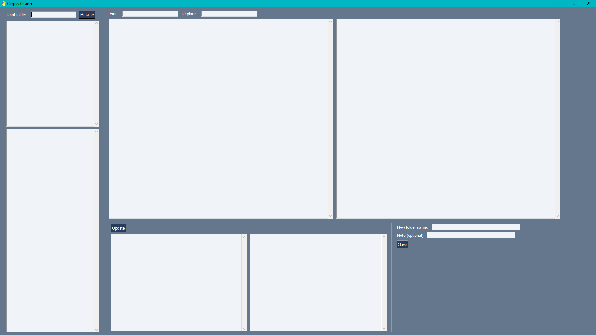</img>

## Select the root folder

Type/paste the path into the input box, or use the 'Browse' button.

</img>

## Select a subfolder

You should now see all available subfolders listed in the listbox below. Click on one to select it.

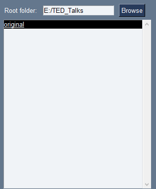</img>

## Select a file

You should now see all .txt files in the subfolder listed in the listbox below. Click on one to select it.

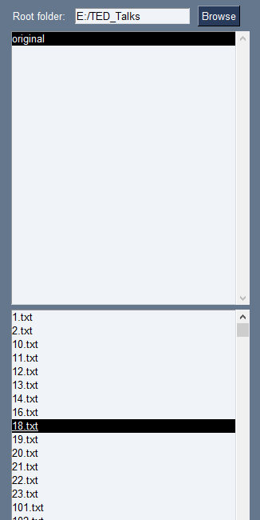</img>

## Preview find+replace operations on individual files

You should now see the text from the selected file in the leftmost of the two large text areas in the middle of the window.

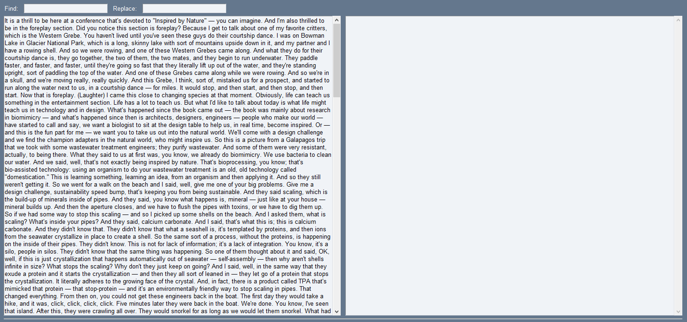</img>

Let's try previewing a simple regex match on the text. Typing a single letter into the 'Find' input box highlights all instances of that letter in the text.

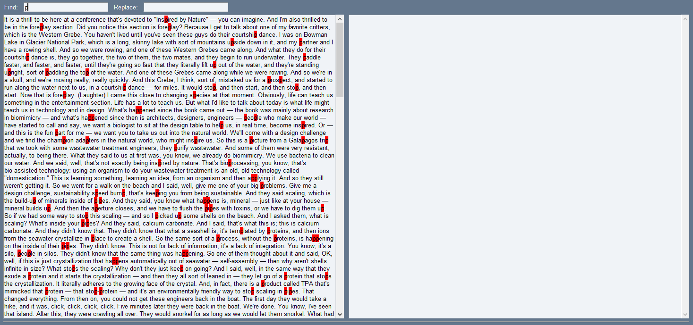</img>

If we type another letter into the 'Replace' input, we can see the result of carrying out a full find+replace operation on this file.

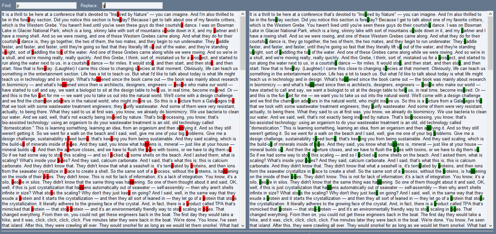</img>

We can view the effect of the same find+replace operation on other files in the corpus by selecting them in the file selection list on the left.

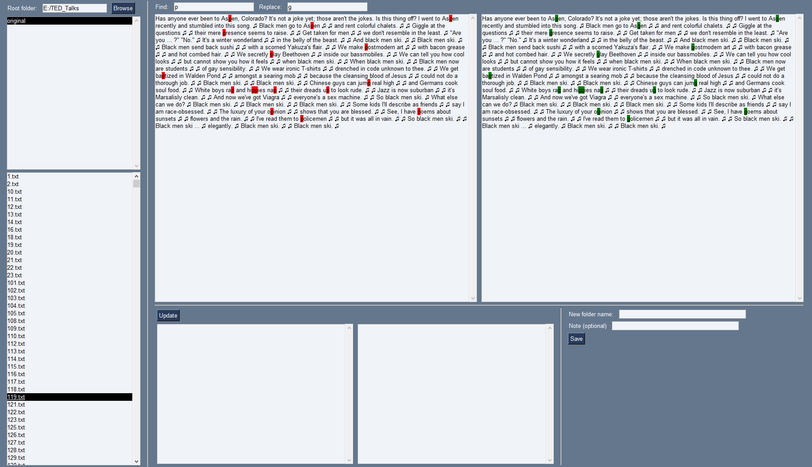</img>

Note that we are still previewing the results at this stage - no files will be affected until we hit the 'Save' button later.

For my use case, I wanted to find all expressions inside brackets, including any surrounding spaces, and replace them with a single space. I experimented with various regular expressions by typing characters into the 'Find' input and checking the preview until I found the right combination, and then entered a single space character into the 'Replace' input. I can confirm that the find+replace operation will have the intended effect on multiple instances in this file.

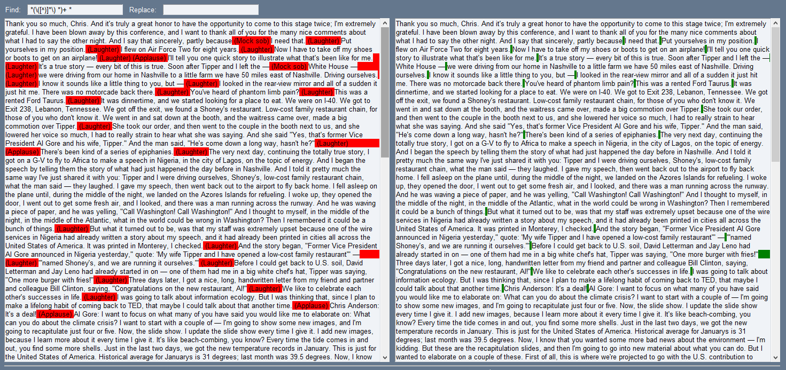</img>

As before, I can click through files on the left to preview the result of making changes. But before commiting to this change, I want to convince myself that there are no edge cases that will lead to unintended results on the text in my corpus.

## Get a broader overview of the effect of the operation over the whole corpus

The section underneath the file preview section on the left is the corpus occurrence overview section.

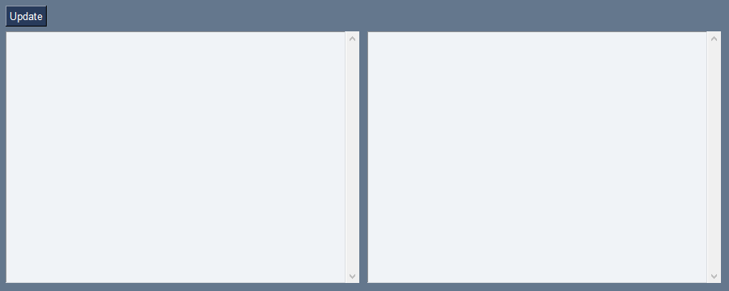</img>

Hitting the 'Update' button populates the leftmost listbox with actual strings matches together with the number of times they occur in the corpus, sorted in descending order of frequency.

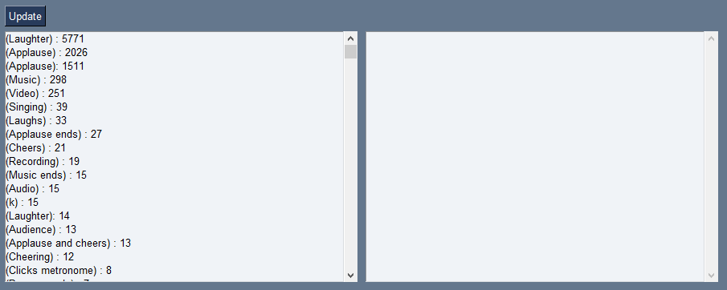</img>

I can see that brackets are primarily used for adding extra information about the goings-on at the talk, such as '(Laughter)', '(Applause)'. However, I want to make sure that there are no cases where the information inside the brackets is relevant to the meaning of the text, because I want to keep the text as coherent as possible for my use case. The first interesting match I see is '(k)', so I decide to investigate further by clicking on it in the list. This shows the files in which it occurs, together with the number of times it occurs in each file.

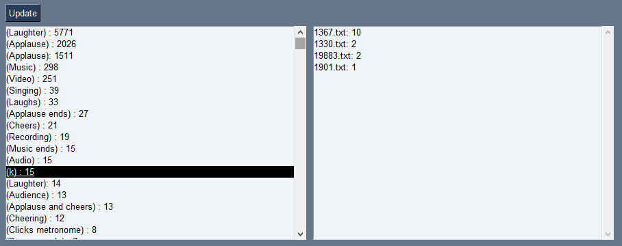</img>

Clicking on a file selects it in the left-hand file selection list and updates the before/after preview above.

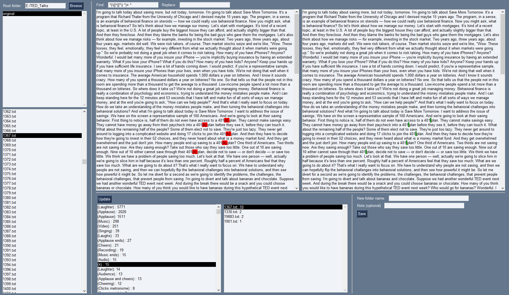</img>

I can see that '(k)' occurs in the context of talking about [401(k) plans](https://www.investopedia.com/terms/1/401kplan.asp). This is relevant information that I don't want to lose altogether, but I can't keep brackets in the final version of the corpus for my use case, so I decide to replace all instances of '401(k)' with '401k' as the first step before coming back to remove remaining bracketed expressions.

## Saving an 'iteration' of the corpus

I've put in the new find and replace regexes and confirmed the changes, and now I'm ready to save a new iteration of my corpus.

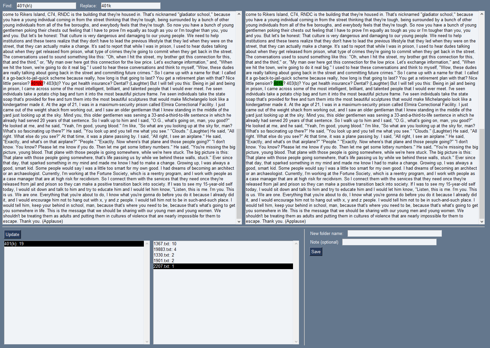</img>

Next, I go to the save section in the bottom right and input the new folder name along with a note to help me track what changes I made and why. The note will be included in the log file, which we'll see in a moment.

</img>

I hit the 'Save' button, and all of the displays are reset. The new subfolder '01' now appears in the subfolder list on the left, so I can select this and continue to make the next change.

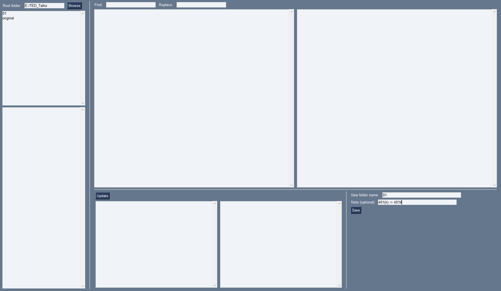</img>

A new file named 'log.txt' has been created in the root folder containing all the details of the change. This file will be appended to when I make future changes.

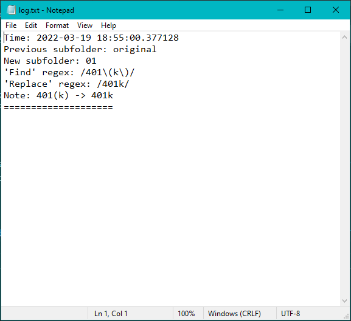</img>